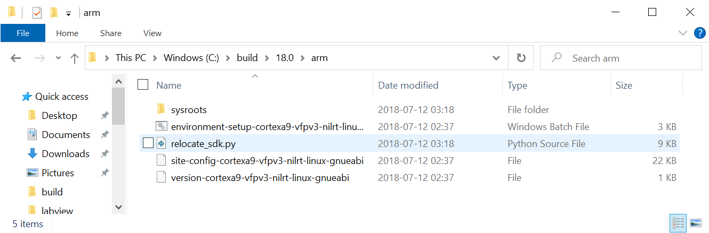
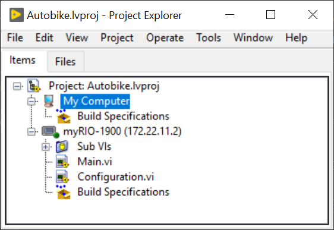
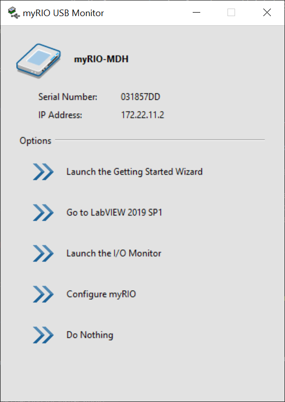
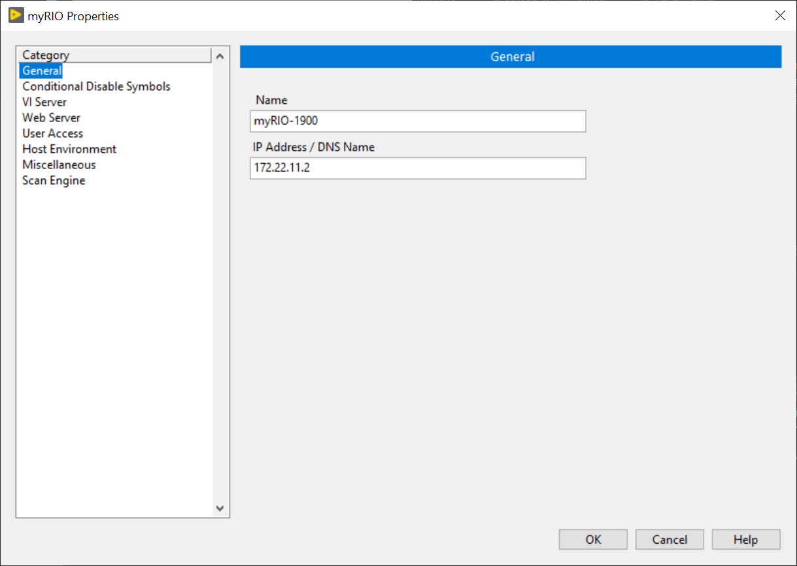
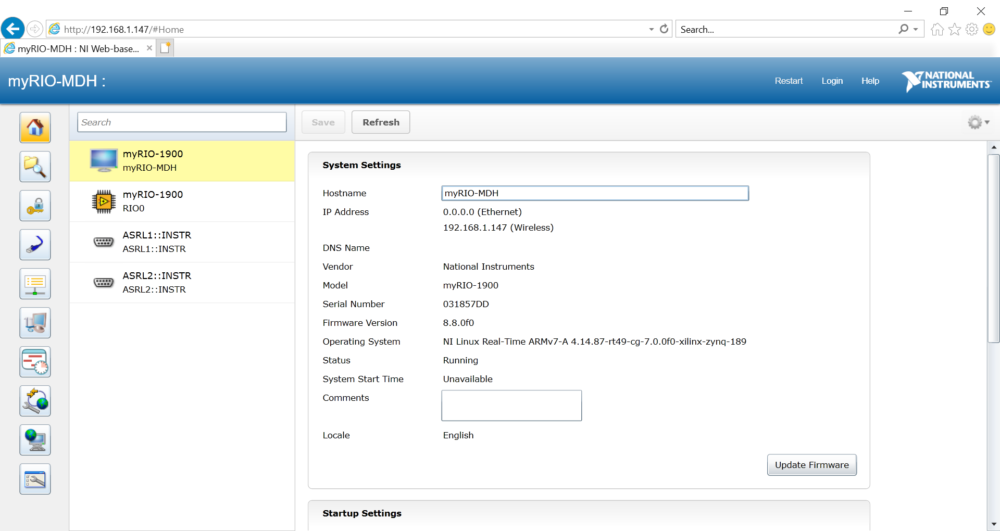
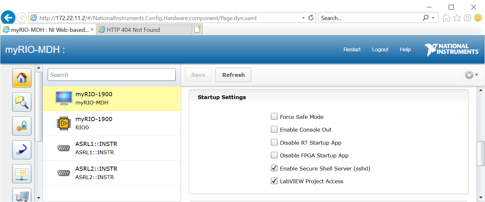
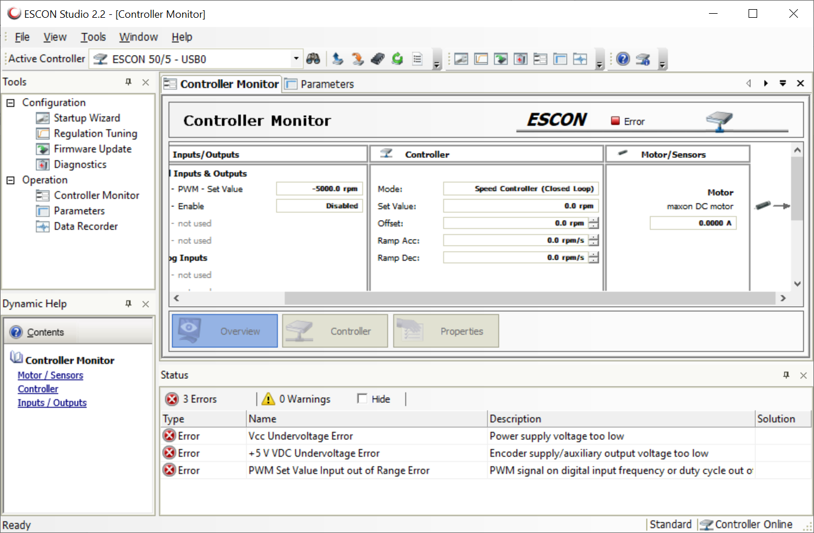

# Autobike manual <!-- omit in toc -->

# Table of contents <!-- omit in toc -->

- [Running the bike](#running-the-bike)
  - [Prerequisites](#prerequisites)
  - [Getting started](#getting-started)
    - [View the code](#view-the-code)
    - [Connect myRIO to your PC](#connect-myrio-to-your-pc)
      - [USB connection](#usb-connection)
      - [WiFi connection](#wifi-connection)
      - [Finishing up connection](#finishing-up-connection)
    - [Optional: Building C code for myRIO](#optional-building-c-code-for-myrio)
    - [Uploading C code to the myRIO](#uploading-c-code-to-the-myrio)
    - [Optional: Building C code for RUT955](#optional-building-c-code-for-rut955)
    - [Uploading scripts and C code to the RUT955](#uploading-scripts-and-c-code-to-the-rut955)
- [Hardware](#hardware)
  - [myRIO](#myrio)
    - [myRIO WiFi configuration](#myrio-wifi-configuration)
    - [myRIO SSH configuration](#myrio-ssh-configuration)
  - [ESCON](#escon)
  - [FSESC](#fsesc)
  - [RUT955](#rut955)
- [About the code](#about-the-code)
- [Developing the code](#developing-the-code)
- [Additional resources](#additional-resources)
  - [LabVIEW](#labview)
  - [git](#git)

# Running the bike

## Prerequisites

A computer with the Windows operating system is currently required to use the bikes.

**Make sure to get the 2019 (SPI) version of all LabVIEW products!**

1. Install [LabVIEW myRIO Software Bundle](https://www.ni.com/es-es/support/downloads/software-products/download.labview-myrio-software-bundle.html#305936)
2. Install [git](https://git-scm.com/downloads)
3. Install [VS Code](https://code.visualstudio.com/Download)
4. For building C code for myRIO (only get these if you know you need them): 
   1. Install the 2018-2019 version of [GNU C & C++ Compile Tools for ARMv7](https://www.ni.com/sv-se/support/downloads/software-products/download.gnu-c---c---compile-tools-for-armv7.html#338448). Use [7-zip](https://www.7-zip.org/download.html) to extract the download to `C:\build\18.0\arm`. The resulting file structure should look as follows:  
      
   2. Install [Ninja](https://ninja-build.org/). Make sure to add the folder where `ninja.exe` is located to your `PATH` (instructions [here](https://stackoverflow.com/a/44272417))
   3. Install [CMake](https://cmake.org/download/)
   
   > [Related Documentation](https://nilrt-docs.ni.com/cross_compile/config_dev_system.html)
5. For building C code for RUT955 (only get these if you know you need them):
   1. Install [WSL](https://learn.microsoft.com/en-us/windows/wsl/install). WSL stands for Windows Subsystem for Linux. Windows now ships with linux, allowing you to run a linux distro without using a virtual machine. You should probably get the Ubuntu distro (which is installed by default).

Also have a look at [Additional resources](#additional-resources) to learn more about how to use LabVIEW and git.

## Getting started

If you are running the code on new bike hardware, make sure to [configure the hardware](#hardware-configuration) correctly.

### View the code

Open git bash or cmd in a directory of your choosing (However, please **NOTE**: Do not use spaces in the directory path!) and enter

```console
git clone --recurse-submodules https://github.com/OssianEriksson/Autobike/
```

Start LabVIEW and open [`labview/Autobike.lvproj`](./../myrio/labview/Autobike.lvproj). You should now see something like the image below:

  

You are now able to open and edit VIs, but you cannot run the code since the code only runs on myRIOs, and you are not yest connected to one.

Also open the root folder of this repository in VS Code (File > Open Folder...). Installing the recommended VS Code extensions from [extensions.json](../.vscode/extensions.json), either though the popup that shows up when you open the directory in VS Code, or by pressing <kbd>F1</kbd> and selecting "Extensions: Show Recommended Extensions" and installing all the Workspace Recommendations that show up in the left sidebar.

### Connect myRIO to your PC

You can connect the myRIO to a PC using either USB or WiFi. First make sure the myRIO (and optionally the RUT955) is powered on.

#### USB connection

Connect the USB type B port to a USB port on the computer. You might see a popup like the image below. You can safetly ignore or close this window, it is a sign that everything works.  



#### WiFi connection

First, the RUT955 must be turned on to provide WiFi. Next, the myRIO must be connected to the WiFi. If the myRIO is already configured to do this, the WiFi LED of the myRIO should become solid blue a few minutes after the WiFi comes online. Otherwise you have to first [connect the myRIO to the RUT955's WiFi](#wifi-connection). Finally, make sure you also connect your own PC to the RUT955's WiFi. Alternatively, as a back-up, you could connect the myRIO (and your PC) to any other available WiFi network (like e.g. WiFi hotspot from your phone).

#### Finishing up connection

Depending on which method you use to connect the myRIO to your PC, it will by default be accessible through different IP:s:

* WiFi: 192.168.1.147
* USB: 172.22.11.2

In order to connect LabVIEW to the myRIO, from the Project Explorer window, right click the "myRIO-1900" entry and select "Properties". Under the "General tab", make sure "IP Address / DNS Name" is set to the correct IP as described above.

  

Finally, close the myRIO Properties window, right click the "myRIO-1900" entry again and select "Connect". Depending on whether the program was already present on the myRIO or not, connection can take long time (5-10 min). During this time LabVIEW can stop responding - just be patient.

### Optional: Building C code for myRIO

This project calls C code from LabVIEW code. The C code is compiled outside LabVIEW and then uploaded to the myRIO where the LabVIEW code can access it.

Built C code should alreday be commited to the repo. To build yourself,

1. Press <kbd>F1</kbd>, select "Tasks: Run Task", then "MyRIO: CMake Generate Build Files"  
   This prepares the build configuration
2. Press <kbd>F1</kbd>, select "Tasks: Run Task", then "MyRIO: Ninja"  
   This builds the C code

### Uploading C code to the myRIO

If the SSH server is not enabled on your myRIO (which it is not from the factory), you must [enable it](#myrio-ssh-configuration). Next, press <kbd>F1</kbd>, select "Tasks: Run Task", then "MyRIO: Upload". This task runs the batch script [`upload-to-myrio.cmd`](../myrio/c/upload-to-myrio.cmd) which uploads the built files from [`bin`](../myrio/c/bin/) to the myRIO via `scp`. In the output of the task, answer "Yes" to any questions and enter the password of the myRIO user when prompted.

> [Related Documentation](https://nilrt-docs.ni.com/cross_compile/config_vs_code.html)

### Optional: Building C code for RUT955

RTK correction is provided to the u-blox board from the RUT955 over USB. The RTK correction data is read by a program called tiny-ntrip which implemets a client for the ntrip protocol (the protocol used to send RTK corrections). This program is compiled from outside the RUT955 and uploaded to it. The compilation requires a linux computer, or WSL which [you should already have installed](#prerequisites). Beware that the setup of the required build tools can take multiple hours.

1. Launch WSL or your linux computer
2. Run `sudo apt update`
3. Install GNU Make with `sudo apt install make`
4. Install the OpenWRT toolchain according to instructions [here](https://learn.microsoft.com/en-us/windows/wsl/install).
  * Make sure you clone to `~/build/openwrt`: `git clone https://git.openwrt.org/openwrt/openwrt.git ~/build/openwrt`.
  * You may have to use an older commit in order for all the required settings to be present. Do this only if you encouter problems when running `make menuconfig`: `git checkout 41a1a652fbd407a40d55a07bccdbc92770a4c2be`
  * When configuring with `make menuconfig`, Target system should be "Atheros ATH79", Subtarget should be "Generic" and Target Profile should be "Teltronika RUT955".
  * You don't need to set the `PATH` variable as it is automatically set for you in [`tasks.json`](../.vscode/tasks.json).
5. Open the Autobike project from VS Code inside WSL according to instructions from [here](https://code.visualstudio.com/docs/remote/wsl#_open-a-remote-folder-or-workspace).
6. Press <kbd>F1</kbd>, select "Tasks: Run Task", then "RUT955: Make"  
   This builds the C code

> [Related Documentation](https://openwrt.org/docs/guide-developer/helloworld/start)

### Uploading scripts and C code to the RUT955

If you previously built C code for the RUT955 yourself, for this next part, make sure you are not using WSL.

Make sure the RUT955 is running and that you are connected to its WiFi. Next, press <kbd>F1</kbd>, select "Tasks: Run Task", then "RUT955: Upload". This task runs the batch script [`upload-to-rut955.cmd`](../rut955/upload-to-rut955.cmd) which uploads scripts from [`scripts`](../rut955/scripts/) and the built files from [`bin`](../rut955/bin/) to the RUT955 via `scp`. In the output of the task, answer "Yes" to any questions and enter the password of the RUT955 user when prompted.

# Hardware

An updated list of hardware parts can be found on the Components tab of [this](https://docs.google.com/spreadsheets/d/1jYklFR16tM9HWh2FWQ4a0sHuk9EQhuwHWUT15zN2rlk/edit?usp=sharing) spreadsheet.

## myRIO

The myRIO has a web UI and is also accessable via SSH (if first enabled through the web UI). The web UI which is used for configuration shares a lot of the interface with [NI MAX](https://knowledge.ni.com/KnowledgeArticleDetails?id=kA03q000000YGQwCAO&l=sv-SE) software which may alternatively be used to configure the myRIO. Both the default web UI and SSH credentials are

* Username: "admin"
* Password: blank (just press enter) or "admin"

To use the web interface, first [connect to the myRIO](#connect-myrio-to-your-pc) and then browse to the myRIO's IP in Internet Explorer (newever browsers won't work). You should get to a page like the image below:

  

### myRIO WiFi configuration

Connect to the myRIO and open the Web UI or NI MAX. Under the network tab, you can configure the myRIO to connect to the WiFi of the RUT955, assuming the RUT955 is turned on:

  

### myRIO SSH configuration

The ssh server (named sshd) can be enabled from the myRIO web interface or NI MAX. Check the box "Enable Secure Shell Server (sshd)" as shown in the image below, then restart the myRIO.

  

> [Related documentation](https://knowledge.ni.com/KnowledgeArticleDetails?id=kA03q000000YHpxCAG&l=sv-SE)

## ESCON

The ESCON motor controller can be configured using [ESCON Studio](https://www.maxongroup.com/maxon/view/content/escon-detailsite). Notably, you can change which RPM the max and min PWM widths of 10 and 90 percent correspond to. As of writing this document, these values should be set to +-4000 RPM at 10 and 90 percent respectively.

  

## FSESC

Can be configured using the [VESC tool](https://vesc-project.com/vesc_tool). Using this tool, the FSESC should be configured for the drive motor which your perticular bike sports. Files containing the configuration of each bike can be found under the [`config`](../config/) directory. These files can be read and applied (and saved) by the VESC tool.

## RUT955

WiFi Passwords:

* Red bike: "Ec78RaFf"

Credentials for ssh login:

* Username: "root"
* Password: "Autobike1"

Or if this does not work the default username/password are

* Username: "admin"
* Password: "admin01"

# About the code

Note that no custom bitfile is loaded to the myRIO FPGA. By default, LabVIEW then loads a default FPGA bitfile which interfaces with the blocks seen under the `myRIO` section in the functions palette. If one customizes the FPGA, then the blocks under the `myRIO` section will no longer work since they rely on the default FPGA functionality. In our case, all the functionality we need is already implemented in the default FPGA and accessible though the `myRIO` blocks, so we can keep the default FPGA.

The LabVIEW code makes use of the LabVIEW Real-Time module in order to run multiple tasks in parallel. In order to pass data between tasks, we currently use Data Value References. We tried using Tag Channels, however these really hurt performance (possibly because we used them to pass large clusters).

# Developing the code

First make sure you are able to [run the bike](#running-the-bike).

> [Related Documentation](https://nilrt-docs.ni.com/cross_compile/config_vs_code.html)

# Additional resources

## LabVIEW

* *Recommended*: [LabVIEW tutorials on YouTube](https://www.youtube.com/watch?v=1WiE__onbeY&t=1178s&ab_channel=LabVIEWExercises)

## git

* *Recommended*: [Introduction to git on YouTube](https://www.youtube.com/watch?v=HVsySz-h9r4)
