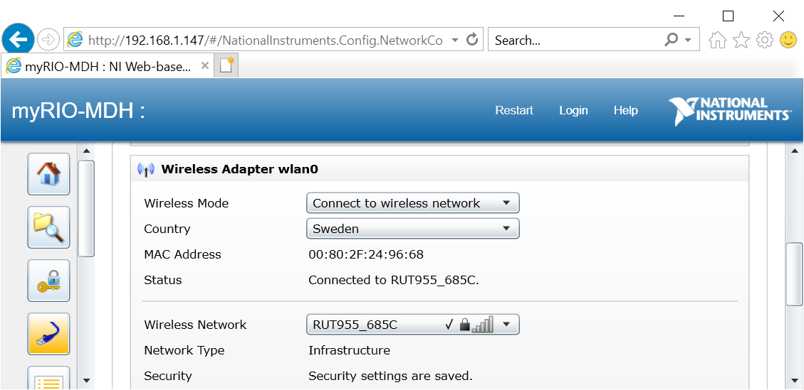

# Autobike manual <!-- omit in toc -->

# Table of contents <!-- omit in toc -->

- [Running the bike](#running-the-bike)
  - [Prerequisites](#prerequisites)
  - [Getting started](#getting-started)
    - [Open the code in LabVIEW](#open-the-code-in-labview)
    - [Connect myRIO to your PC](#connect-myrio-to-your-pc)
      - [USB connection](#usb-connection)
      - [WiFi connection](#wifi-connection)
      - [Finishing up connection](#finishing-up-connection)
    - [Optional: Building C code](#optional-building-c-code)
    - [Uploading C code to the myRIO](#uploading-c-code-to-the-myrio)
- [Hardware](#hardware)
  - [myRIO](#myrio)
    - [myRIO WiFi configuration](#myrio-wifi-configuration)
    - [myRIO SSH configuration](#myrio-ssh-configuration)
  - [ESCON](#escon)
  - [FSESC](#fsesc)
- [About the code](#about-the-code)
- [Developing the code](#developing-the-code)
- [Additional resources](#additional-resources)
  - [LabVIEW](#labview)
  - [git](#git)

# Running the bike

## Prerequisites

**Make sure to get the 2019 (SPI) version of all LabVIEW products!**

1. Install [LabVIEW myRIO Software Bundle](https://www.ni.com/es-es/support/downloads/software-products/download.labview-myrio-software-bundle.html#305936)
2. Install [LabVIEW FPGA Module](https://www.ni.com/sv-se/support/downloads/software-products/download.labview-fpga-module.html#305897)
3. Install the 2018-2019 version of [GNU C & C++ Compile Tools for ARMv7](https://www.ni.com/sv-se/support/downloads/software-products/download.gnu-c---c---compile-tools-for-armv7.html#338448). Use [7-zip](https://www.7-zip.org/download.html) to extract the download to `C:\build\18.0\arm`. The resulting file structure should look as follows:  
   
4. Install [git](https://git-scm.com/downloads)
5. Install [VS Code](https://code.visualstudio.com/Download)
6. For building C code: 
   1. Install [Ninja](https://ninja-build.org/). Make sure to add the folder where `ninja.exe` is located to your `PATH` (instructions [here](https://stackoverflow.com/a/44272417))
   2. Install [CMake](https://cmake.org/download/)

Also have a look at [Additional resources](#additional-resources) to learn more about how to use LabVIEW and git.

## Getting started

To get started, open the root folder of this repository in VS Code (File > Open Folder...). Begin by installing the recommended extensions from [extensions.json](../.vscode/extensions.json), either though the popup that shows up when you open the directory, or by pressing <kbd>F1</kbd> and selecting "Extensions: Show Recommended Extensions" and installing all the Workspace Recommendations that show up in the left sidebar.

If you are running the code on new bike hardware, make sure to [configure the hardware](#hardware-configuration) correctly.

### Open the code in LabVIEW

Open git bash or cmd in a directory of your choosing and enter

```console
git clone https://github.com/OssianEriksson/autobike/
```

Start LabVIEW and open [`labview/Autobike.lvproj`](./../labview/Autobike.lvproj). You should now see something like the image below:

  

You are now able to open and edit VIs, but you cannot run the code since the code only runs on myRIOs, and you are not yest connected to one.

### Connect myRIO to your PC

You can connect the myRIO to a PC using either USB or WiFi. First make sure the myRIO (and optionally the RUT955) is powered on.

#### USB connection

Connect the USB type B port to a USB port on the computer. You might see a popup like the image below. You can safetly ignore or close this window, it is a sign that everything works.  


#### WiFi connection

First, the RUT955 must be turned on to provide WiFi. Next, the myRIO must be connected to the WiFi. If the myRIO is already configured to do this, the WiFi LED of the myRIO should become solid blue a few minutes after the WiFi comes online. Otherwise you have to first [connect the myRIO to the RUT955's WiFi](#wifi-connection). Finally, make sure you also connect your own PC to the RUT955's WiFi.

#### Finishing up connection

Depending on which method you use to connect the myRIO to your PC, it will by default be accessible through different IP:s:

* WiFi: 192.168.1.147
* USB: 172.22.11.2

In order to connect LabVIEW to the myRIO, from the Project Explorer window, right click the "myRIO-1900" entry and select "Properties". Under the "General tab", make sure "IP Address / DNS Name" is set to the correct IP as described above.

  

Finally, close the myRIO Properties window, right click the "myRIO-1900" entry again and select "Connect". Depending on whether the program was already present on the myRIO or not, connection can take long time (5-10 min). During this time LabVIEW can stop responding - just be patient.

### Optional: Building C code

Built C code should alreday be commited to the repo. To build yourself,

1. Press <kbd>F1</kbd>, select "Tasks: Run Task" and "CMake Generate Build Files"  
   This prepares the build configuration
2. Press <kbd>F1</kbd>, select "Tasks: Run Task" and "Ninja"  
   This builds the C code

### Uploading C code to the myRIO

If the SSH server is not enabled on your myRIO (which it is not from the factory), you must [enable it](#myrio-ssh-configuration).

# Hardware

An updated list of hardware parts can be found on the Components tab of [this](https://docs.google.com/spreadsheets/d/1jYklFR16tM9HWh2FWQ4a0sHuk9EQhuwHWUT15zN2rlk/edit?usp=sharing) spreadsheet.

## myRIO

The myRIO has a web UI and is also accessable via SSH (if first enabled through the web UI). The web UI which is used for configuration shares a lot of the interface with [NI MAX](https://knowledge.ni.com/KnowledgeArticleDetails?id=kA03q000000YGQwCAO&l=sv-SE) software which may alternatively be used to configure the myRIO. Both the default web UI and SSH credentials are

* Username: admin
* Password: admin

To use the web interface, first [connect to the myRIO](#connect-myrio-to-your-pc) and then browse to the myRIO's IP in Internet Explorer (newever browsers won't work). You should get to a page like the image below:

  

### myRIO WiFi configuration

Connect to the myRIO and open the Web UI or NI MAX. Under the network tab, you can configure the myRIO to connect to the WiFi of the RUT955, assuming the RUT955 is turned on:

  

### myRIO SSH configuration

The ssh server (named sshd) can be enabled from the myRIO web interface or NI MAX.

## ESCON

The ESCON motor controller can be configured using [ESCON Studio](https://www.maxongroup.com/maxon/view/content/escon-detailsite). Notably, you can change which RPM the max and min PWM widths of 10 and 90 percent correspond to. As of writing this document, these values should be set to +-4000 RPM at 10 and 90 percent respectively.

  

## FSESC

Can be configured using the [VESC tool](https://vesc-project.com/vesc_tool). Using this tool, the FSESC should be configured for the drive motor which your perticular bike sports.

# About the code

Note that no custom bitfile is loaded to the myRIO FPGA. By default, LabVIEW then loads a default FPGA bitfile which interfaces with the blocks seen under the `myRIO` section in the functions palette. If one customizes the FPGA, then the blocks under the `myRIO` section will no longer work since they rely on the default FPGA functionality. In our case, all the functionality we need is already implemented in the default FPGA and accessible though the `myRIO` blocks, so we can keep the default FPGA.

The LabVIEW code makes use of the LabVIEW Real-Time module in order to run multiple tasks in parallel. In order to pass data between tasks, we currently use Data Value References. We tried using Tag Channels, however these really hurt performance (possibly because we used them to pass large clusters).

# Developing the code

First make sure you are able to [run the bike](#running-the-bike).

# Additional resources

## LabVIEW

* *Recommended*: [LabVIEW tutorials on YouTube](https://www.youtube.com/watch?v=1WiE__onbeY&t=1178s&ab_channel=LabVIEWExercises)

## git

* *Recommended*: [Introduction to git on YouTube](https://www.youtube.com/watch?v=HVsySz-h9r4)
